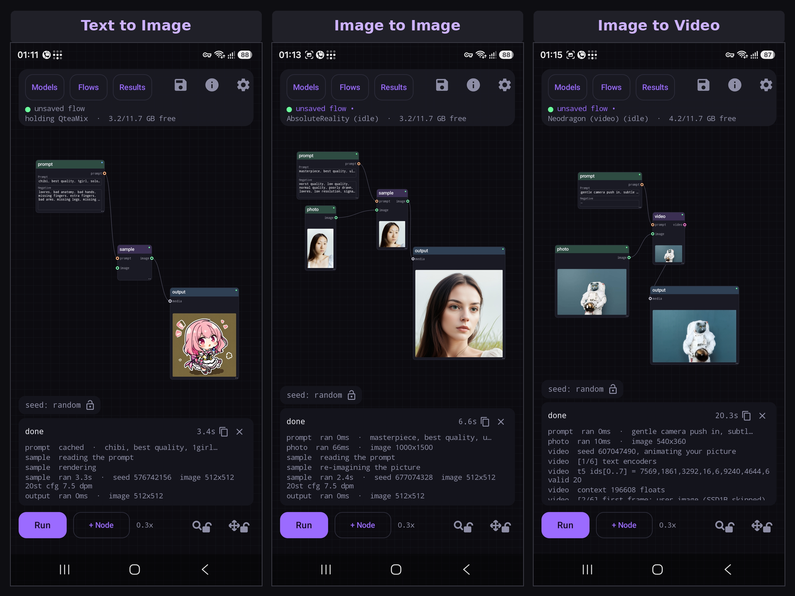

# Nightmare Mobile

**A ComfyUI style node graph for Stable Diffusion — and now video — on Android, running
entirely on device.**

Local text to image, image to image, inpainting and **text to video** on the Qualcomm Hexagon
NPU. No server, no account, no cloud, no network. Built on LocalDream's NPU backend.

<p align="center">
  
</p>

> **Early and experimental.** It works, and it has been run on exactly one phone.
> The plugin format can still change between versions.

**[Download the APK](https://github.com/AbrahamPaulJ/nightmare-mobile/releases/latest)** —
Android 12 or newer, arm64, and a Snapdragon with a Hexagon NPU. Models are not in the APK;
pick one in the app and it downloads on first use.

Stable Diffusion 1.5, SDXL and Anima run locally on a Snapdragon NPU, offline. You draw a graph,
press Run, and the picture appears on the node that made it. Everything stays on the phone.

⚠ **Video is much narrower than pictures, and needs ~8.6 GB of models.** It runs only on a
**Snapdragon 8 Elite (gen 4) or 8 Elite Gen 5 (gen 5)** — nothing older, because a compiled
model runs on the architecture it was built for and every newer one. The app decides by
*running* a small real model on your chip rather than by reading its name, so it tells you
before you spend the 8.6 GB — and on a phone that cannot, video is hidden everywhere rather
than offered and then failing.

⚠ None of that applies to pictures. Text to image, image to image, inpainting and upscaling
run on far more phones and need none of those models.

**Keywords:** on device AI, offline Stable Diffusion, ComfyUI for Android, mobile
Stable Diffusion, local image generation, on device video generation, node editor,
Qualcomm Hexagon NPU, Snapdragon, QNN, SDXL, Anima, text to image, text to video, image to video,
img2img, inpainting, Segment Anything, SAM 2.1, npuforge, safetensors to QNN, on device model
conversion, no cloud, private.

## What it does

- **A canvas built for a phone.** Big ports, snap to connect, pinch to zoom, a node palette
  in a sheet. Not a desktop editor shrunk down.
- **Text to video, on the NPU.** A prompt in, 49 frames at 1024x640 out — about two seconds
  of clip in about 25 seconds on an 8 Elite. ⚠ See the requirements above: ~8.6 GB of models
  and an 8 Elite or 8 Elite Gen 5. **Image to video** animates a photo
  instead, and is the faster of the two — same three nodes, with a photo wired in. The clip
  loops on the node that made it and plays full screen.
- **Seven node types, not seventy.** A flow is `prompt → generate → output`, plus a photo
  where one is wanted. Cropping, masking, encoding, sampling, blending and decoding happen
  **inside** the sampler, because there is no runtime compiler on an NPU and nobody can
  recombine the inside of a pipeline anyway — so the whole process is one node. Inpainting
  used to be ten nodes and is four. **Tap to select**: the Inpaint flow comes with a
  Segment model node wired in and tap what you want redone — Segment Anything 2.1 on the phone's CPU, an 87 MB
  download under Models, Tools.
- **The ops are still decomposed underneath.** `encode_text`, `vae_encode`, `sample`,
  `latent_blend` and `vae_decode` are separate endpoints, and conditionings and latents move
  between them as handles that never cross the wire — a 512 image costs about 40 bytes of
  JSON instead of 780 KB. A plugin reaches the ops; a person reaches the nodes.
- **Two checkpoints in one graph.** Each sampler carries its own, and the executor orders the
  run to minimise backend relaunches — finish everything under the model already loaded, then
  switch. The run bar says what the relaunches will cost before you press Run.
- **Recipes to start from.** Text to image, image to image, inpainting where you paint the
  area to redo, upscale a photo, and both video flows — each laid out so no wire crosses and
  the whole graph fits the screen when it opens.
- **Batching.** Arm `seed`, `steps`, `cfg`, `denoise` or `scheduler` on the sampler and Run
  sweeps them. Two knobs at once gives you a grid. Every run is kept with the exact graph
  that produced it.
- **Upscalers.** RealESRGAN x4plus anime and 4x UltraSharp V2 Lite, loaded per request so
  they cost no process restart.
- **Pick your size.** SD 1.5 renders any resolution its checkpoint ships a patch for — 512²
  up to 1024², portrait and landscape; SDXL and Anima crop their fixed 1024² canvas to the
  shape you choose.
- **Bring your own model.** Twenty-four checkpoints in the catalogue — five SD 1.5, ten SDXL
  and nine Anima — or import a converted one as a zip, including SDXL converted by
  **[npuforge](https://github.com/AbrahamPaulJ/npuforge)**, which turns an SD safetensors
  checkpoint into a QNN model **on the phone itself, with no PC involved**. ⚠ Anima is 8 Gen 3 or newer, ~4.3 GB
  per checkpoint, and slow: about 80 s a picture on an 8 Elite, and Android may stop it
  while other apps are busy. Each sampler has its own checkpoint picker, grouped
  by family, listing what is actually on the phone; switching family rewrites that node and
  keeps every wire. The app carries every HTP architecture tier and picks the build your chip can
  actually load. The video models are their own download under Models, resumable per file
  because 8.6 GB over a phone connection will be interrupted.
- **Bring your own nodes.** A manifest and a script, no toolchain, no app release.
- **English, 中文 and Русский.** The interface follows your phone's language. Adding another
  is a file drop — copy `app/src/main/res/values/strings.xml` into a `values-<code>/`
  folder and translate it; no code changes. ⚠ Model prompts are never translated: SD 1.5
  reads English tags, so a translated prompt would render something else.
- **Offline and private.** Nothing is uploaded, there is no account, and no prompt or
  picture leaves the phone. The only thing that ever does is a file you explicitly share.

## Writing a node

Two files. Nothing is compiled, and nothing needs a new version of the app.

`node.json`

```json
{
  "id": "com.example.center-square",
  "version": "0.1.0",
  "api": 1,
  "nodes": [{
    "type": "CenterSquare",
    "category": "image",
    "tier": 0,
    "inputs":  [{ "name": "image", "type": "IMAGE" }],
    "outputs": [{ "name": "image", "type": "IMAGE" }],
    "widgets": [
      { "name": "size", "type": "int", "default": 192, "min": 16, "max": 2048 }
    ]
  }],
  "permissions": ["image"]
}
```

`index.js`

```js
__nm.register('com.example.center-square:CenterSquare', {
  run: function (ctx, inputs, widgets) {
    var info = ctx.host('image.info', { image: inputs.image });
    var side = Math.min(info.width, info.height);

    var square = ctx.host('image.crop', {
      image: inputs.image,
      x: Math.floor((info.width  - side) / 2),
      y: Math.floor((info.height - side) / 2),
      width: side,
      height: side
    });

    return ctx.host('image.resize', {
      image: square.image,
      width: parseInt(widgets.size, 10),
      height: parseInt(widgets.size, 10)
    });
  }
});
```

Zip the two files and import them from the Flows tab, or push the folder to the app's plugin
directory. Four worked examples are in [`examples/`](examples/).

**What a node can reach.** Inputs arrive as ids, never as pixels, and `ctx.host` is the whole
surface:

| op | takes |
|---|---|
| `image.info` | an image, returns width and height |
| `image.resize` | image, width, height |
| `image.crop` | image, x, y, width, height |
| `image.new` | width, height, colour |
| `image.composite` | base, overlay, x, y, optional mask |
| `image.blend` | a, b, alpha |
| `image.grayscale`, `image.invert` | an image |
| `latent.blend` | two latents and a mask image |

Widgets are declared, not drawn. Give a number `min` and `max` and you get a slider, give it
`options` and you get a dropdown or a row of chips, add a `hint` and it appears under the
control. An author picks values, never widgets, so no pack invents its own controls.

**What a node cannot do yet.** There is no host op that runs a model, so a plugin cannot
segment, detect or estimate anything — the built-in segmenter is not reachable from a script.
That is the next tier and it is not built. Scripts run
in a QuickJS sandbox with permissions denied by default, but nothing yet bounds how long one
may run, so treat an imported pack the way you would treat any other code you did not write.

## Building it

JDK 17 and Android SDK 35.

```
gradlew.bat assembleDebug
```

The NPU backend is a native binary and the QNN runtime libraries are not in this repository.
Without them the app builds and the canvas works, but nothing renders.

## Credits

The NPU work is not ours. This app forks the C++ inference server from
[xororz/local-dream](https://github.com/xororz/local-dream), which is where the QNN pipelines,
the model conversions, the per chipset build tiers and the device gating all come from. The
checkpoint and upscaler archives it downloads are published by the same author. Anyone
interested in how Stable Diffusion runs on a Hexagon NPU at all should start there rather
than here.

[LocalDream](https://github.com/AbrahamPaulJ/dreamui) is the consumer app built on that
backend, and it stays the simpler way to generate a picture on a phone. Its mask editor,
brush behaviour and batch strip are ported here rather than reinvented, on purpose: someone
who has both installed should not have to learn the same tool twice.

The video is not ours either. It is
[Neodragon](https://huggingface.co/Qualcomm-AI-Research/Neodragon) by Qualcomm AI Research,
released under BSD-3-Clause-Clear with additional terms on the model card. The pyramidal
schedule, the autoregressive MMDiT loop and the streaming VAE decode are theirs; the NPU
conversions this app runs were made from their weights. Its first frame comes from
[SSD-1B](https://huggingface.co/segmind/SSD-1B) by Segmind, Apache 2.0.

What is new here is the graph. Pipelines were decomposed into ops, latents and conditionings
became handles, node types became something a contributor can add without an app release, and
the video path was taken apart into the same kind of nodes as the picture one.

## Licence

**CC BY-NC 4.0**, inherited rather than chosen. This project derives from
[xororz/local-dream](https://github.com/xororz/local-dream), which is released under that
licence, and it continues under the same terms. No further restrictions are added here.

Share it, fork it, build on it. Do not sell it or ship it inside something you sell.

Full text in [LICENSE](LICENSE); attribution and third party components in [NOTICE](NOTICE).

The Qualcomm AI Runtime libraries the app needs at runtime are covered by Qualcomm's own
terms, which this licence does not override. They are not in this repository.

## Support

[buymeacoffee.com/abrahampaulj](https://buymeacoffee.com/abrahampaulj)

Tips are welcome and change nothing: the app stays free, offline and CC BY-NC, and nothing is
gated behind them. A donation is not a purchase of the software and does not grant commercial
rights the licence withholds.
